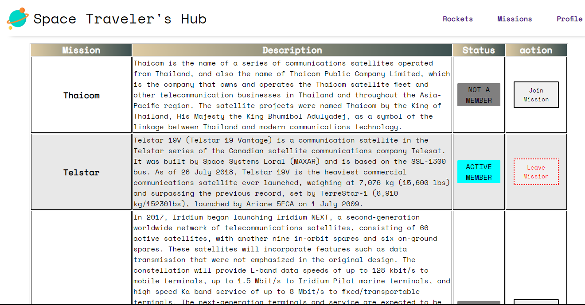
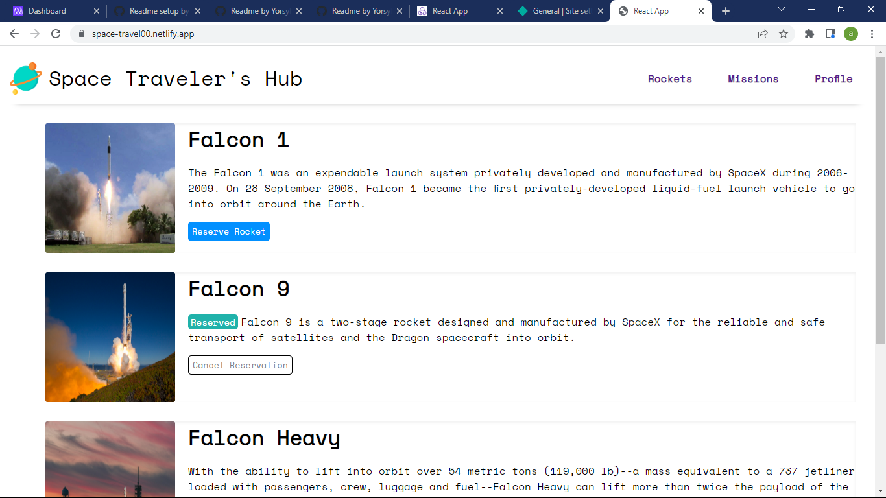
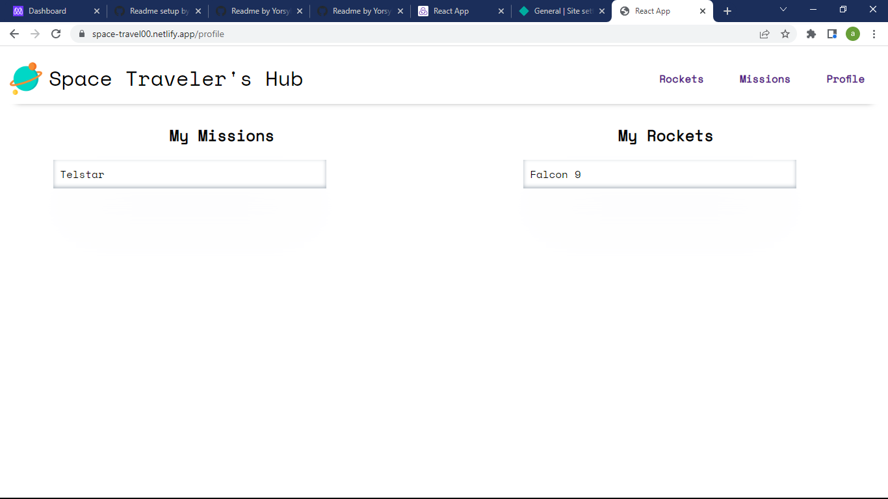

# Space Traveler's Hub

> Space Travel allows users to book rockets and join selected missions.

  
  
  

## Built With

- React
- Redux

## Live Demo

[Live Demo Link](https://space-travel00.netlify.app/)

## Getting Started

To get a local copy up and running follow these simple example steps.

### Prerequisites

A Web Browser (preferably Google Chrome)

### Setup

- Clone the GitHub Repository
- Go to the Project Directory
- Run `npm install`
- Run `npm run build` to build the project

### Usage

- Run `npm run start` to start the live server

## Authors

👤 **Toyosi Taiwo**

- GitHub: [@Yorsyboy](https://github.com/Yorsyboy)
- Twitter: [@tboytaiwo](https://twitter.com/Tboytaiwo)
- LinkedIn: [LinkedIn](https://linkedin.com/in/taiwo-toyosi)

👤 **Joy Kwamboka**

- GitHub: [Joyous Kwambiee](https://github.com/kwambiee)
- Twitter: [Joy Kwambiee](https://twitter.com/kwambiee)
- LinkedIn: [LJoy Kwambiee](https://www.linkedin.com/in/joy-kwamboka/)
- E-mail: kwambokaj2.jk@gmail.com

## 🤝 Contributing

Contributions, issues, and feature requests are welcome!

Feel free to check the [issues page](../../issues/).

## Show your support

Give a ⭐️ if you like this project!

## Acknowledgments

- Microverse

## 📝 License

This project is [MIT](./LICENSE) licensed.
